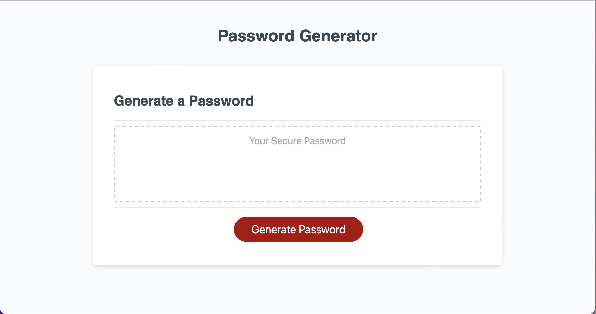

# Password Generator

## Table of Contents
* [Desciption](#description)
* [Visuals](#visuals)
* [How to use](#use)

## Description
This is a password generator I created using javaScript.
[Link to live site]()

## Visuals

## How to use
This generator allows a user to create a password between 8 - 12 characters.  The user can choose whether to include lowercase letters, uppercase letters, numbers, and/or special characters.  The user needs to choose at least one of these character options in order to generate a password.